#Azure-Infrastructure-and-Access-Management Lab

## Scenario

A school IT department needs a secure way to manage its cloud systems, control who has access, and keep track of costs. This project creates an Azure environment where IT staff can safely manage a school server, protect sensitive login information, and follow rules for how cloud resources are used. Budget monitoring is also added so the school can avoid unexpected cloud expenses.

## Skills & Tools

| Category | Tools/Skills |
|---|---|
| Cloud Administration | Microsoft Azure, Resource Groups, Virtual Machines |
| Identity & Access | Microsoft Entra ID, Security Groups, Azure RBAC |
| Credential Protection | Azure Key Vault, Secrets |
| Policy & Standards | Azure Policy, Initiative Definitions, Parameters |
| Cost Management | Azure Budgets, Spending Alerts |
| Server Administration | Windows Server 2022, RDP |
| Verification | Access checks, Policy compliance, Resource review |

## Environment

- **Subscription:** Azure for Students
- **Resource Group:** `RG-SchoolIT-Lab`
- **Virtual Machine:** `test-vm`
- **Operating System:** Windows Server 2022 Datacenter: Azure Edition
- **Region:** East US 2
- **Key Vault:** `SchoolIT-KeyVault`
- **Entra Security Group:** `IT-KeyVaultAdmins`
- **Policy Initiative:** `AssetTaggingInitiative`
- **Budget:** `LabBudget`

## Implementation

### 1. Created a Resource Group for the School IT Lab

I created a dedicated resource group called `RG-SchoolIT-Lab` to keep all of the lab resources together in one place. This makes the environment easier to organize, review, and clean up later.

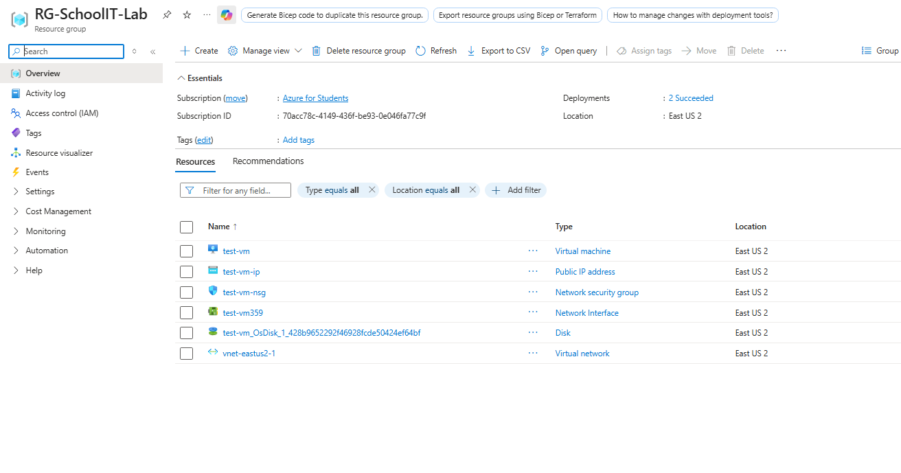  

### 2. Created a Microsoft Entra Security Group

I created a security group called `IT-KeyVaultAdmins` in Microsoft Entra ID. Instead of giving permissions to each person one at a time, the group gives IT staff a central place to manage access.

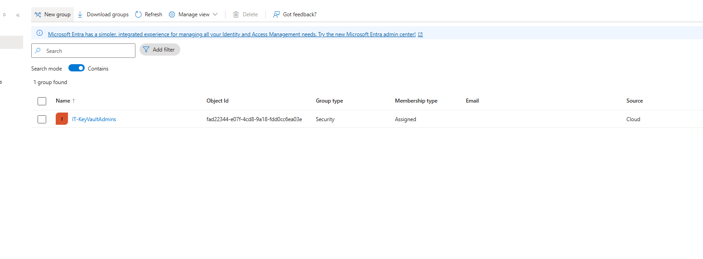  

### 3. Created an Azure Key Vault

I created `SchoolIT-KeyVault` to safely store sensitive information used by the lab. Key Vault keeps passwords and other secrets separate from normal notes or files.

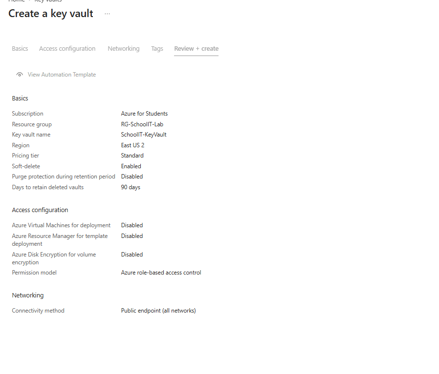  

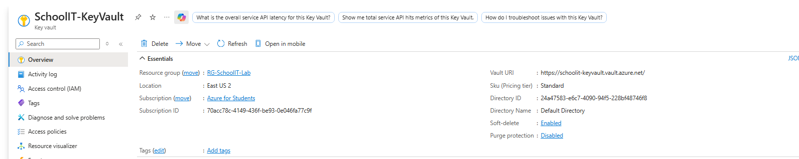  

### 4. Gave the IT Group Access to Key Vault

I assigned the `Key Vault Administrator` role to the `IT-KeyVaultAdmins` group. This allows approved IT staff in that group to manage the vault without giving the same permissions to everyone in the Azure subscription.

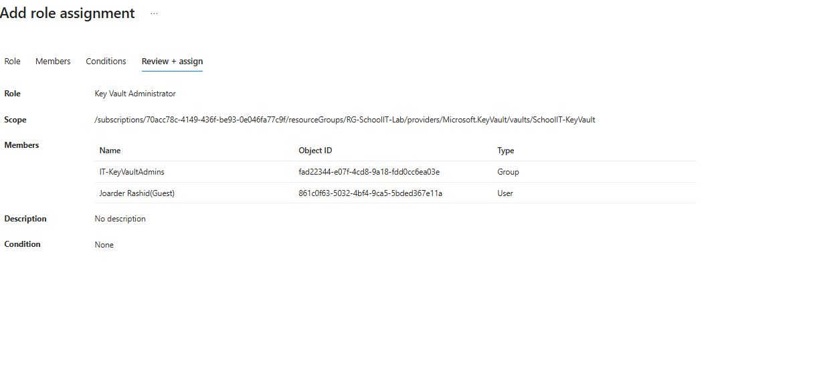  

### 5. Stored Important Secrets in Key Vault

I added a secret for a sample school helpdesk service and another secret for the test virtual machine administrator password. This demonstrates how an IT team can keep important credentials in one protected location instead of writing them down in plaintext.

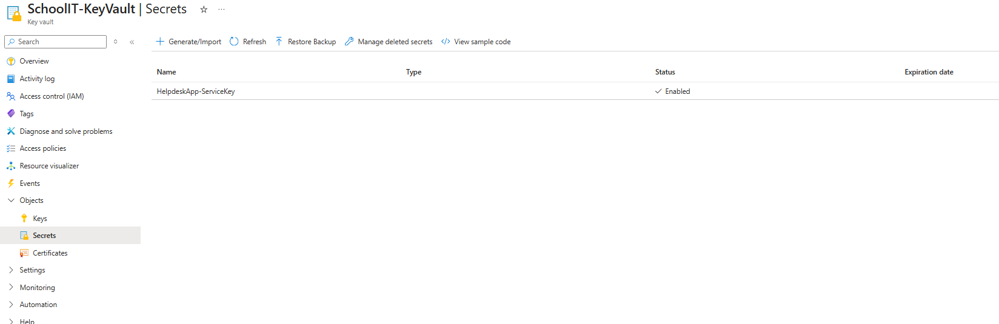  

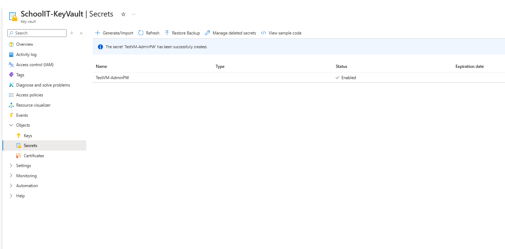  

### 6. Created a Windows Server Virtual Machine

I deployed a Windows Server 2022 virtual machine called `test-vm`. The VM acts as a school IT server that can be used for administrative testing and support tasks.

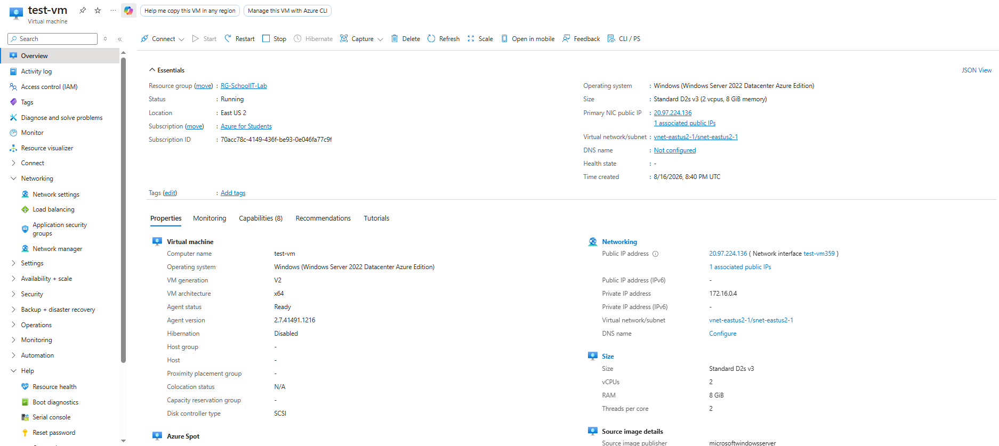  

### 7. Assigned VM Management Permissions

I assigned the `Virtual Machine Contributor` role at the VM level. This gives the selected IT group or user permission to manage the virtual machine without automatically giving control over every resource in the subscription.

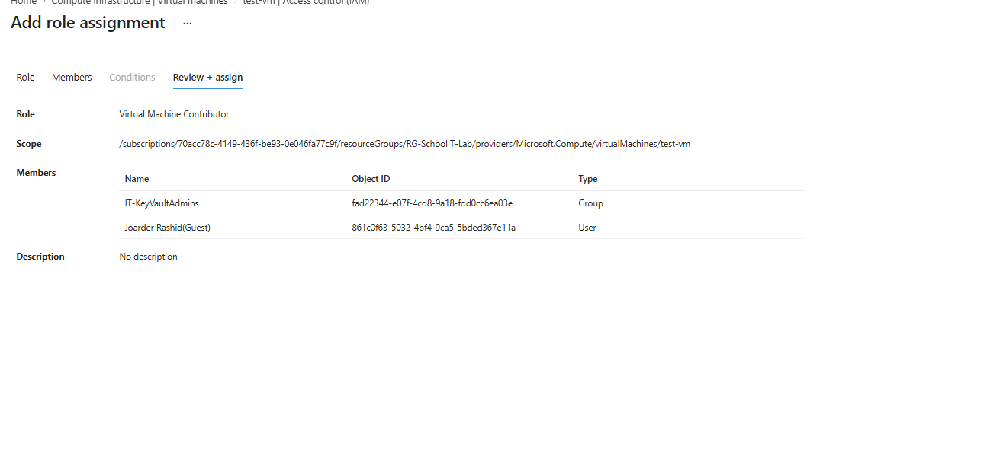  

### 8. Verified the Server Was Working

I connected to the Windows Server virtual machine and confirmed that it was running correctly. This verified that the server deployment and access setup were successful.

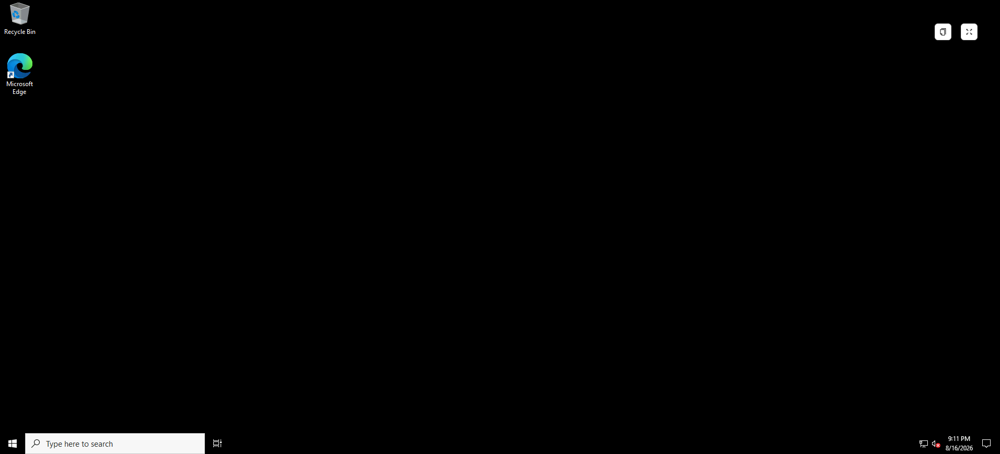  

### 9. Created an Azure Policy Initiative

I created an initiative called `AssetTaggingInitiative`. An initiative groups several Azure rules together so they can be managed and assigned as one set.

For this lab, the initiative was designed to help the school keep resources organized and limit what types of resources can be created.

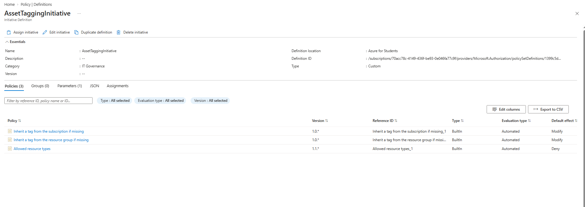  

### 10. Created a Reusable Policy Parameter

I created a parameter called `AllowedTagValue`. This allows the same tag setting to be reused across more than one policy instead of entering the same value separately each time.

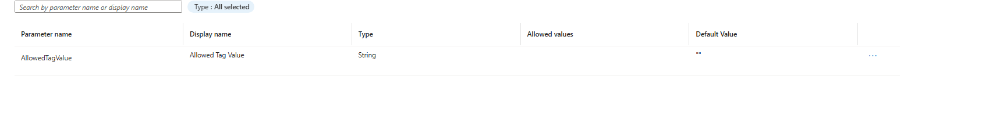  

### 11. Connected the Policy Settings

I connected the tag policies to the shared initiative parameter and set the allowed resource type to Azure virtual machines. This means the initiative can automatically check whether resources follow the rules I selected.

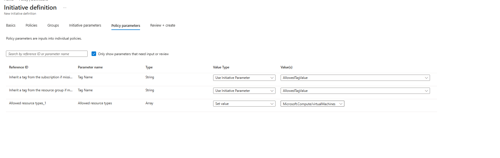  

### 12. Assigned the Initiative

I assigned the initiative to the Azure subscription and selected the tag value that should be used. Once assigned, Azure can begin checking resources against those rules.

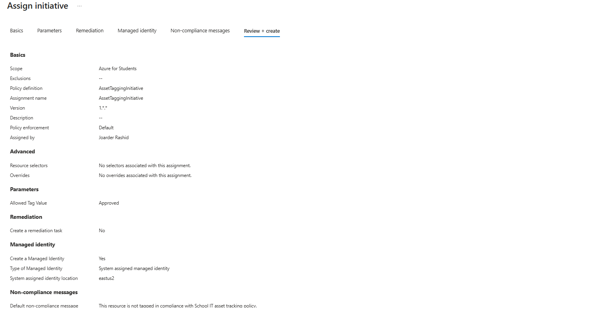  

### 13. Checked Policy Compliance

I opened the policy section for the test VM to see whether Azure had started evaluating it. This shows how an IT administrator can check whether cloud resources are following the organization's rules.

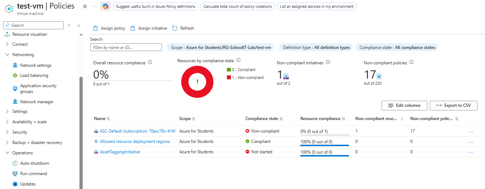  

### 14. Created a Monthly Azure Budget

I created a monthly budget called `LabBudget` with a limit of **$20**. The purpose was to keep track of lab spending and make it easier to notice unexpected costs.

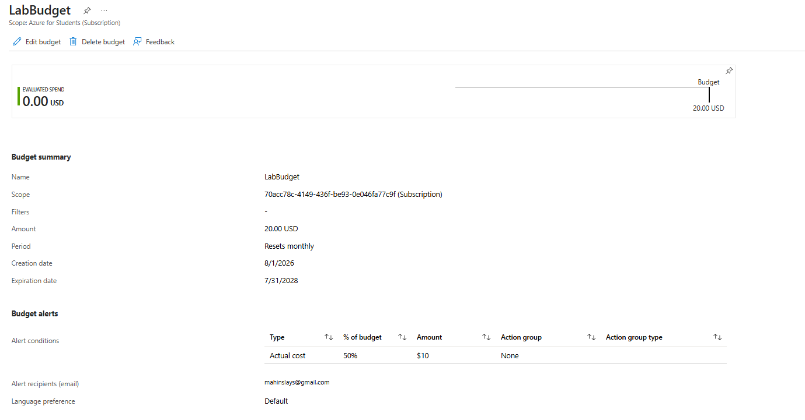  

### 15. Added a Budget Alert

I configured an email alert at **50% of the budget**, or **$10**. This gives the IT team an early warning before the full monthly budget is reached.

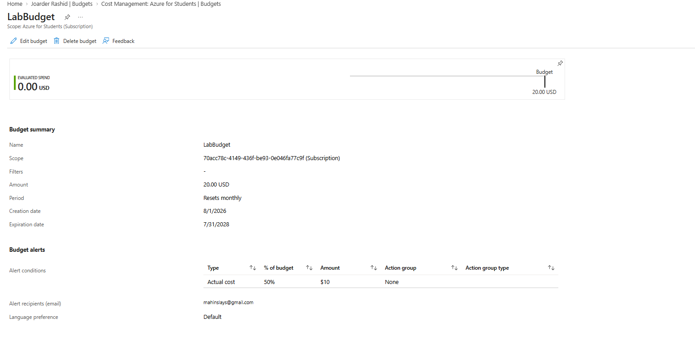  

## Decisions & Why

- **Used a security group instead of assigning every permission individually.** This makes access easier to manage because staff can be added to or removed from one group as responsibilities change.

- **Stored passwords and service secrets in Azure Key Vault.** I chose Key Vault so sensitive information would be kept in a dedicated secure location instead of being written directly into notes, scripts, or documentation.

- **Assigned permissions at the resource level when possible.** This keeps access focused on the resources someone actually needs to manage instead of giving broader control over the entire Azure environment.

- **Grouped multiple rules into one Azure Policy initiative.** This makes the school environment easier to manage because related rules can be assigned and reviewed together.

- **Added a low monthly budget and early alert.** Since this is a lab environment, the goal was to catch unexpected spending quickly rather than waiting until the full budget was reached.

## What This Demonstrates

- **Managing access for IT staff:** I used Microsoft Entra ID groups and Azure roles to control who could manage the Key Vault and virtual machine.

- **Protecting sensitive information:** I used Azure Key Vault to store passwords and service secrets instead of leaving them in normal files or notes.

- **Keeping cloud resources organized:** I used Azure Policy to apply basic rules and check whether the virtual machine followed those rules.

- **Monitoring cloud spending:** I created a monthly budget and alert so the school IT team could see costs early and avoid unexpected charges.

## Why This Project Matters

School IT teams often manage many systems with limited staff, so it is important to keep access simple, credentials protected, resources organized, and costs visible. This project shows a practical way to use Azure for those everyday administrative needs while keeping the environment easier to manage as it grows.
